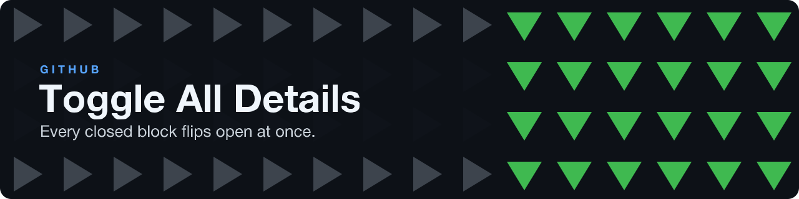

  

  
  
  

  

---

A browser extension for Chrome and Firefox that adds one toolbar button to expand or collapse every `
` block inside GitHub pull request and issue comments. Built for teams whose CI (Atlantis, GitHub Actions, Terraform) posts dozens of collapsible output blocks per PR.

## Features

- One click on the toolbar icon opens every collapsible section on the page; a second click closes them.
- If any block is closed, all open; if all are open, all close.
- Touches only `
` inside comment bodies (`.js-comment-body`), never GitHub's own UI.
- Works on github.com and its `*.github.com` subdomains.
- Plain JavaScript, no dependencies, no build step.
- Manifest V3 on both browsers.

## Quick start

Firefox: install from [Firefox Add-ons](https://addons.mozilla.org/en-US/firefox/addon/toggle-github-details/).

Chrome, Edge or Brave (no store listing):

1. Clone or download this repository.
2. Open `chrome://extensions/`, turn on Developer mode, click Load unpacked and pick the repository folder.
3. Open any pull request with collapsed blocks and click the toolbar icon.

## Documentation

- [How it works](docs/how-it-works.md): the two scripts, the message between them, and the browser table

## License

[GPL-3.0-or-later](LICENSE)
